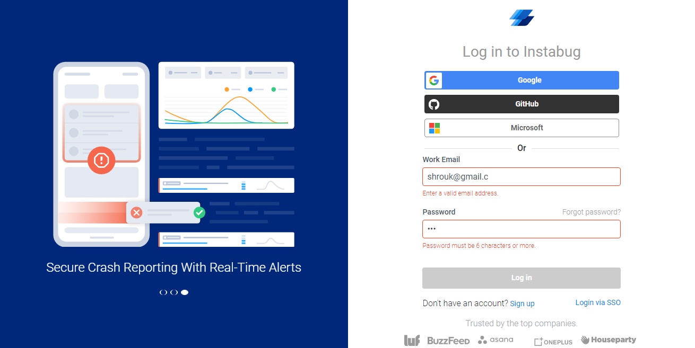
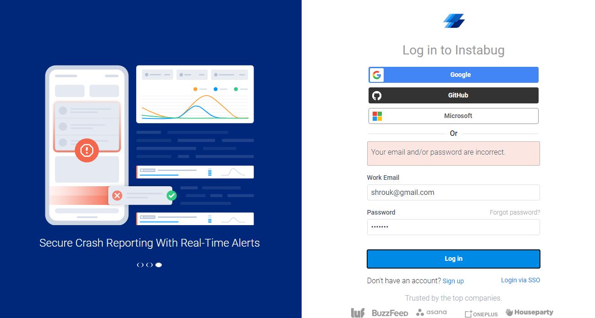
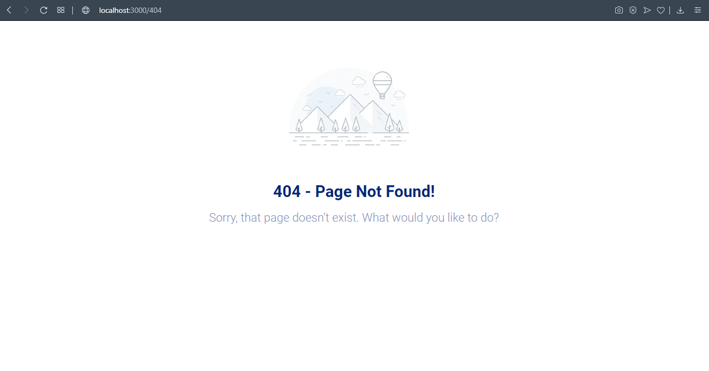

# Instabug Task

Small React App

You can visit the deployed task, at:

https://shrouk-instabug-task.netlify.app/login

### Pages & routes:

1. login page with route/login which contains the login form + slider

2. welcome screen with route /welcome which will contain a welcome message + logout button

4. 404 page with route /404 if u entered any route other than the above it redirects to 404 page

Didn't use any CSS framework

If the entered username and password match any of the users json file, the user should be redirected to the welcome page

In the project directory, you can run:

 `npm start`
